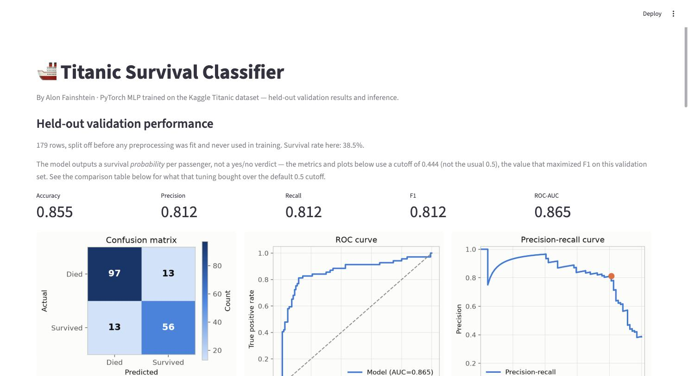
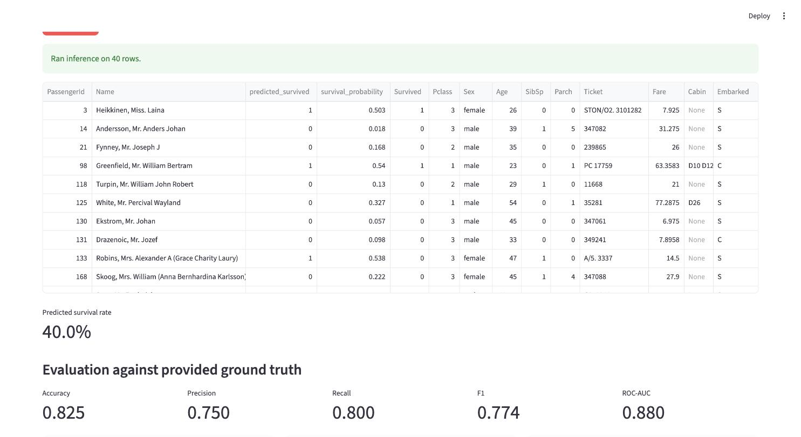

# 🚢 Titanic Survival Classifier

An end-to-end classification pipeline that predicts Titanic passenger survival: a Jupyter EDA
notebook, a standalone PyTorch training script, and a Streamlit app for evaluation and inference.

Built for the Elta AI Data Science home assignment (`elta_ai_home_assignment_ds.md`).

## Contents

- [Project structure](#project-structure)
- [Setup](#setup)
- [Usage](#usage)
- [Example usage](#example-usage)
- [Design choices](#design-choices)
- [Data](#data)
- [Reproducibility](#reproducibility)

## Project structure

```
.
├── fetch_data.py            # downloads train.csv from Kaggle
├── eda.ipynb                # exploratory data analysis
├── preprocessing.py         # TitanicPreprocessor — shared by train.py and ds_app.py
├── model.py                 # TitanicNet — the PyTorch architecture
├── train.py                 # loads data, preprocesses, trains, saves artifacts to models/
├── ds_app.py                # Streamlit app: validation results + inference UI
├── data/
│   ├── train.csv            # real dataset, gitignored — created by fetch_data.py
│   └── sample_train.csv     # small sample, committed, for quick testing
├── models/                  # trained artifacts, gitignored — created by train.py
├── docs/images/             # screenshots used in this README
└── requirements.txt
```

## Setup

### 1. Install dependencies

```bash
git clone <your-repo-url>
cd Elta_Home_Assignment2

python -m venv .venv
source .venv/bin/activate

pip install -r requirements.txt
```

### 2. Kaggle credentials (only needed to fetch the real dataset)

1. Go to [kaggle.com/settings](https://www.kaggle.com/settings) → API → **Create New Token**.
   This downloads `kaggle.json`.
2. Save it to `~/.kaggle/kaggle.json` and restrict its permissions:
   ```bash
   mkdir -p ~/.kaggle
   mv ~/Downloads/kaggle.json ~/.kaggle/kaggle.json
   chmod 600 ~/.kaggle/kaggle.json
   ```
3. Accept the competition rules at
   [kaggle.com/competitions/titanic/rules](https://www.kaggle.com/competitions/titanic/rules) —
   the API returns a 403 without this step, even with a valid token.

You can skip this step entirely if you just want to try the Streamlit app — `data/sample_train.csv`
is already committed and works with the inference tab.

## Usage

### Fetch the dataset

```bash
python fetch_data.py
```

Downloads `train.csv` only, per the assignment brief — never `test.csv` or
`gender_submission.csv`. Skips the download if the file already exists; pass `--force` to
re-download.

### Explore the data

```bash
jupyter lab eda.ipynb
```

Covers missingness (including *missingness as signal*, e.g. `Cabin` correlating with `Pclass`),
target imbalance, numeric/categorical relationships to survival, and the feature-engineering plan
that `preprocessing.py` implements (`Title`, `FamilySize`, `HasCabin`, `IsChild`).

### Train the model

```bash
python train.py
```

Loads `data/train.csv`, splits it 80/20 (stratified on `Survived`, seed 42), fits preprocessing
on the training split only, trains a small PyTorch MLP with early stopping, and writes to
`models/`:

| File | Contents |
|---|---|
| `titanic_model.pt` | best-validation-loss model weights |
| `model_config.json` | hyperparameters, feature names, decision threshold, validation metrics |
| `preprocessor.pkl` | the fitted `TitanicPreprocessor`, reused as-is by `ds_app.py` |
| `val_split.csv` | the raw held-out validation rows, untouched, for the Streamlit eval page |
| `training_log.csv` | per-epoch train/val loss and metrics, for reviewing training runs later |

Useful flags: `--epochs`, `--patience`, `--lr`, `--weight-decay`, `--val-size`, `--seed`. Run
`python train.py --help` for the full list.

### Run the app

```bash
streamlit run ds_app.py
```

Opens at `http://localhost:8501`. Two tabs:

- **Validation results** — metrics, confusion matrix, ROC and precision-recall curves on the
  held-out split, an interactive decision-threshold slider, and the training loss curve.
- **Run inference** — point at any CSV with the raw Titanic schema, get per-row predictions. If
  the CSV also has a `Survived` column, the same evaluation plots are shown against it.

## Example usage

**Validation results** — metrics and plots on the 179-row held-out split:



**Run inference** — predictions on `data/sample_train.csv`:



## Design choices

### Preprocessing

Fit once on the training split only (`TitanicPreprocessor.fit_transform`), then reused unchanged
for validation and inference (`.transform`) — no logic duplicated between `train.py` and
`ds_app.py`. Per the EDA's findings:

- **Engineered:** `Title` (parsed from `Name`, rare titles bucketed), `FamilySize`
  (`SibSp + Parch + 1`), `HasCabin` (from `Cabin` non-null), `IsChild` (`Age < 16`). `SibSp` and
  `Parch` are consumed only to derive `FamilySize`, not kept as separate model inputs — the three
  are collinear by construction, so the raw pair adds no signal the derived total doesn't already
  carry.
- **Imputed:** `Age` by `Pclass`/`Title` group median (better signal than a global median);
  `Embarked` by mode; `Fare` by median (only matters for inference CSVs — `train.csv` has none
  missing).
- **Encoded:** `Sex`, `Embarked`, `Title` one-hot; `Pclass` kept as its natural ordinal integer.
- **Transformed:** `Fare` log-transformed (right-skewed, long tail); all numeric columns
  standardized on the training split's statistics.

### Model

A single hidden layer, width 16, with dropout:

```
Linear(n_features → 16) → ReLU → Dropout(0.3) → Linear(16 → 1)
```

At 16 engineered features and 712 training rows, this is a deliberately small network. Titanic
survival is a well-studied, largely "shallow" problem — dominated by Sex, Pclass, Age/Title, and
family size, all of which are already hand-engineered inputs — so a deeper or wider network adds
memorization risk rather than accuracy. Trained with `BCEWithLogitsLoss`, Adam
(`lr=1e-3`, `weight_decay=1e-4`), and early stopping on validation loss (patience 15).

### Evaluation strategy

An 80/20 stratified split (not 90/10): at 90/10 the validation set would be ~89 rows, small enough
that a single flipped prediction swings F1 by more than a point. 80/20 gives ~178 validation rows
— more stable — without meaningfully hurting the training set.

Accuracy alone is a misleading headline metric here (~38% survived, so a model that always
predicts "died" already scores ~62%). Precision, recall, F1, ROC-AUC, and a confusion matrix are
reported instead, all computed on the held-out split only.

**Decision threshold.** The model is trained to minimize log-loss, which says nothing about where
the 0.5 classification cutoff should sit for an imbalanced target. `train.py` sweeps thresholds on
the validation probabilities and picks the one that maximizes F1 (0.444 in the current run, F1
0.782 → 0.812). This is disclosed, not hidden: both the default-0.5 and tuned-threshold metrics
are saved to `model_config.json` and shown side by side in the app. Worth being explicit about the
caveat — the tuned number is optimized on the same 179-row set it's reported on, so it's an
honest description of what that cutoff buys *on this validation set*, not an independently
validated generalization estimate.

### What was considered and deliberately not built

- **K-fold cross-validation / seed ensembling** — would reduce validation noise, but at this
  dataset size and model size the expected gain is small (a few tenths of an F1 point), and it
  would require a real change to the inference contract (multiple checkpoints, averaged
  predictions) for a benefit smaller than the noise floor of a 179-row validation set.
- **Categorical embeddings** — `Sex`, `Embarked`, `Title` top out at ~8 levels each; one-hot is
  simpler and arguably more interpretable at this scale. Embeddings solve a high-cardinality
  problem this dataset doesn't have.
- **SWA / MC-dropout / LR scheduling** — solve loss-landscape instability and uncertainty
  quantification problems that a 16-unit network trained for a few dozen epochs with early
  stopping doesn't really have.

### Bonus: baseline comparison against a Random Forest

Supplementary context, not the submitted model — `train.py`'s PyTorch MLP is the deliverable this
assignment asks for. This is here to answer a fair question a well-engineered, shallow tabular
problem like Titanic invites: does the model architecture matter, or would a standard baseline do
just as well?

```bash
python compare_baseline.py
```

Both models are scored on the identical 179-row validation split, using the identical
preprocessed features (the already-fitted `TitanicPreprocessor` is reused via `.transform()`, not
refit) — any gap is attributable to the model, not the inputs. The Random Forest gets no tuning
(scikit-learn defaults, fixed seed), and both models are compared at the default 0.5 threshold, so
neither one gets an advantage the other didn't also get.

| Model | Accuracy | F1 | ROC-AUC |
|---|---|---|---|
| PyTorch MLP (this project) | 0.838 | 0.782 | 0.865 |
| RandomForestClassifier (baseline) | 0.804 | 0.741 | 0.833 |

The MLP wins on all three metrics against a stock Random Forest. That's not a foregone
conclusion — an untuned RF often matches or beats a small MLP on a dataset this size — so this is
a genuine result, not a formality: the small hidden layer is picking up something a simple
majority-vote-of-trees baseline doesn't, without the extra capacity of the network reading as
overkill (see [Model](#model) above for why that architecture was chosen in the first place).

## Data

Only `train.csv` is used anywhere in this repo, per the assignment brief — `test.csv` and
`gender_submission.csv` are never touched. `data/sample_train.csv` (40 rows, stratified to
preserve the ~38% survival rate) is committed so the repo is usable without Kaggle credentials;
the real `data/train.csv` is fetched by `fetch_data.py` and gitignored.

## Reproducibility

- Fixed seed (42) for the train/validation split and model initialization.
- `requirements.txt` lists tested versions alongside the minimum-version floors.
- Everything `train.py` writes to `models/` is regenerated from scratch on every run — nothing
  there is hand-edited or committed.
