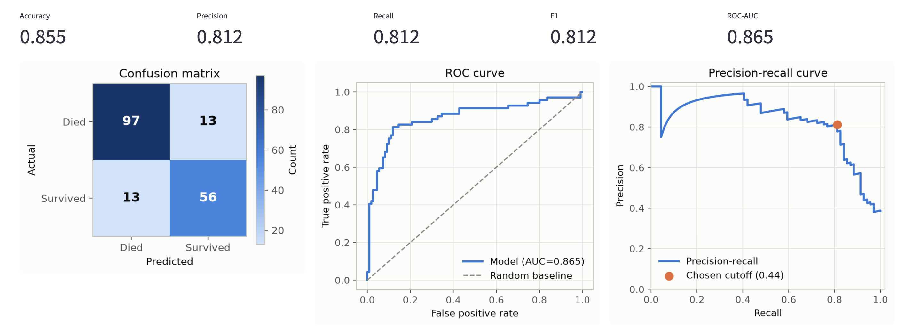
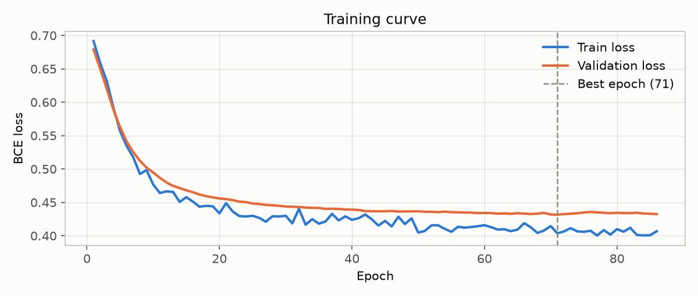

# 🚢 Titanic Survival Classifier

An end-to-end classification pipeline that predicts Titanic passenger survival: a Jupyter EDA
notebook, a standalone PyTorch training script, and a Streamlit app for evaluation and inference.

Built for the Elta AI Data Science home assignment (`elta_ai_home_assignment_ds.md`).

## Contents

- [Project structure](#project-structure)
- [Setup](#setup)
- [Usage](#usage)
- [Example usage](#example-usage)
- [Design choices](#design-choices)
- [Data](#data)
- [Reproducibility](#reproducibility)

## Project structure

```
.
├── fetch_data.py            # downloads train.csv from Kaggle
├── eda.ipynb                # exploratory data analysis
├── preprocessing.py         # TitanicPreprocessor — shared by train.py and ds_app.py
├── model.py                 # TitanicNet — the PyTorch architecture
├── train.py                 # loads data, preprocesses, trains, saves artifacts to models/
├── ds_app.py                # Streamlit app: validation results + inference UI
├── compare_baseline.py      # bonus: RandomForest comparison, needs train.py run first
├── data/
│   ├── train.csv            # real dataset, gitignored — created by fetch_data.py
│   └── sample_train.csv     # small sample, committed, for quick testing
├── models/                  # trained artifacts, gitignored — created by train.py
├── docs/images/             # screenshots used in this README
└── requirements.txt
```

## Setup

### 1. Install dependencies

```bash
git clone https://github.com/alonfines/elta-titanic-classifier
cd elta-titanic-classifier

python -m venv .venv
source .venv/bin/activate

pip install -r requirements.txt
```

### 2. Kaggle credentials (only needed to fetch the real dataset)

1. Go to [kaggle.com/settings](https://www.kaggle.com/settings) → API → **Create New Token**.
   This downloads `kaggle.json`.
2. Save it to `~/.kaggle/kaggle.json` and restrict its permissions:
   ```bash
   mkdir -p ~/.kaggle
   mv ~/Downloads/kaggle.json ~/.kaggle/kaggle.json
   chmod 600 ~/.kaggle/kaggle.json
   ```
3. Accept the competition rules at
   [kaggle.com/competitions/titanic/rules](https://www.kaggle.com/competitions/titanic/rules) —
   the API returns a 403 without this step, even with a valid token.


## Usage

### Fetch the dataset

```bash
python fetch_data.py
```

Downloads `train.csv` only, per the assignment brief — never `test.csv` or
`gender_submission.csv`. Skips the download if the file already exists; pass `--force` to
re-download.

### Explore the data

```bash
jupyter lab eda.ipynb
```

Covers missingness (including *missingness as signal*, e.g. `Cabin` correlating with `Pclass`),
target imbalance, numeric/categorical relationships to survival, and the feature-engineering plan
that `preprocessing.py` implements (`Title`, `FamilySize`, `HasCabin`, `IsChild`).

### Train the model

```bash
python train.py
```

Loads `data/train.csv`, splits it 80/20 (stratified on `Survived`, seed 42), fits preprocessing
on the training split only, trains a small PyTorch MLP with early stopping, and writes to
`models/`:

| File | Contents |
|---|---|
| `titanic_model.pt` | best-validation-loss model weights |
| `model_config.json` | hyperparameters, feature names, decision threshold, validation metrics |
| `preprocessor.pkl` | the fitted `TitanicPreprocessor`, reused as-is by `ds_app.py` |
| `val_split.csv` | the raw held-out validation rows, untouched, for the Streamlit eval page |
| `training_log.csv` | per-epoch train/val loss and metrics, for reviewing training runs later |

Useful flags: `--epochs`, `--patience`, `--lr`, `--weight-decay`, `--val-size`, `--seed`. Run
`python train.py --help` for the full list.

### Run the app

```bash
streamlit run ds_app.py
```

Opens at `http://localhost:8501`. One page, top to bottom:

- **Validation results** — metrics, confusion matrix, and ROC/precision-recall curves on the
  held-out split, evaluated at the F1-maximizing decision threshold rather than the usual 0.5
  (see [Decision threshold](#evaluation-strategy) below for the full reasoning), plus a
  default-vs-tuned comparison table. The training-loss curve and full hyperparameters are in
  [Training process](#training-process) below instead of live in the app.
- **Run inference** — point at any CSV with the raw Titanic schema, get per-row predictions. If
  the CSV also has a `Survived` column, the same evaluation plots are shown against it.

## Example usage

**Validation results** — metrics and plots on the 179-row held-out split:



## Design choices

### Preprocessing

Fit once on the training split only (`TitanicPreprocessor.fit_transform`), then reused unchanged
for validation and inference (`.transform`) — no logic duplicated between `train.py` and
`ds_app.py`. Per the EDA's findings:

- **Engineered:** `Title` (parsed from `Name`, rare titles bucketed), `FamilySize`
  (`SibSp + Parch + 1`), `HasCabin` (from `Cabin` non-null), `IsChild` (`Age < 16`). `SibSp` and
  `Parch` are consumed only to derive `FamilySize`, not kept as separate model inputs — the three
  are collinear by construction, so the raw pair adds no signal the derived total doesn't already
  carry.
- **Imputed:** `Age` by `Pclass`/`Title` group median (better signal than a global median);
  `Embarked` by mode; `Fare` by median (only matters for inference CSVs — `train.csv` has none
  missing).
- **Encoded:** `Sex`, `Embarked`, `Title` one-hot; `Pclass` kept as its natural ordinal integer.
- **Transformed:** `Fare` log-transformed (right-skewed, long tail); all numeric columns
  standardized on the training split's statistics.

The 16 resulting model inputs (also in `model_config.json`'s `feature_names`, regenerated fresh
by every `train.py` run): `Sex_female`, `Sex_male`, `Embarked_C`, `Embarked_Q`, `Embarked_S`,
`Title_Master`, `Title_Miss`, `Title_Mr`, `Title_Mrs`, `Title_Rare`, `Age`, `FareLog`,
`FamilySize`, `HasCabin`, `IsChild`, `Pclass`.

### Model

A single hidden layer, width 16, with dropout:

```
Linear(n_features → 16) → ReLU → Dropout(0.3) → Linear(16 → 1)
```

At 16 engineered features and 712 training rows, this is a deliberately small network. Titanic
survival is a well-studied, largely "shallow" problem — dominated by Sex, Pclass, Age/Title, and
family size, all of which are already hand-engineered inputs — so a deeper or wider network adds
memorization risk rather than accuracy.

### Training process

Loss and optimizer: `BCEWithLogitsLoss` (binary cross-entropy on raw logits — paired with the
model's un-activated output, more numerically stable than a manual sigmoid + `BCELoss`), Adam
(`lr=1e-3`, `weight_decay=1e-4`), batch size 32.

The train/validation split (`val_size=0.2`, i.e. the same 80/20 ratio discussed under
[Evaluation strategy](#evaluation-strategy) below) is created once before any training starts, so
the validation set is never touched by gradient updates. Training runs for up to 300 epochs, but
stops early once validation loss hasn't improved for 15 straight epochs (`patience=15`) — the
checkpoint that's actually saved and evaluated is whichever epoch had the *lowest* validation
loss, not the final epoch's weights, so a little post-optimal drift before stopping doesn't cost
anything. In the current run this triggered at epoch 86 (best epoch: 71) — training loss kept
inching down past that point while validation loss had already flattened out, which is exactly
the gap early stopping exists to catch:



All of this is seeded (`seed=42`, threaded through `random`/`numpy`/`torch`) for a reproducible
run. Every hyperparameter above is a `train.py` flag (`--epochs`, `--patience`, `--lr`,
`--weight-decay`, `--batch-size`, `--val-size`, `--seed`) rather than a hardcoded constant — see
[Train the model](#train-the-model) above for the full list. The per-epoch train/validation loss
and metrics for every run are written to `models/training_log.csv` for closer inspection.

### Evaluation strategy

An 80/20 stratified split: 80/20 gives ~178 validation rows

Accuracy alone is a misleading headline metric here (~38% survived, so a model that always
predicts "died" already scores ~62%). Precision, recall, F1, ROC-AUC, and a confusion matrix are
reported instead, all computed on the held-out split only.

**Decision threshold.** The model is trained to minimize log-loss, which says nothing about where
the 0.5 classification cutoff should sit for an imbalanced target. `train.py` sweeps thresholds on
the validation probabilities and picks the one that maximizes F1 (0.444 in the current run, F1
0.782 → 0.812). This is disclosed, not hidden: both the default-0.5 and tuned-threshold metrics
are saved to `model_config.json` and shown side by side in the app.

### Bonus: baseline comparison against a Random Forest

Supplementary context, not the submitted model — `train.py`'s PyTorch MLP is the deliverable this
assignment asks for. This is here to answer a fair question a well-engineered, shallow tabular
problem like Titanic invites: does the model architecture matter, or would a standard baseline do
just as well?

```bash
python compare_baseline.py
```

Both models are scored on the identical 179-row validation split, using the identical
preprocessed features (the already-fitted `TitanicPreprocessor` is reused via `.transform()`, not
refit) — any gap is attributable to the model, not the inputs. The Random Forest gets no tuning
(scikit-learn defaults, fixed seed), and both models are compared at the default 0.5 threshold, so
neither one gets an advantage the other didn't also get.

| Model | Accuracy | F1 | ROC-AUC |
|---|---|---|---|
| PyTorch MLP (this project) | 0.838 | 0.782 | 0.865 |
| RandomForestClassifier (baseline) | 0.804 | 0.741 | 0.833 |

The MLP wins on all three metrics against a stock Random Forest.

## Data

Only `train.csv` is used anywhere in this repo, per the assignment brief — `test.csv` and
`gender_submission.csv` are never touched. The real `data/train.csv` is fetched by `fetch_data.py` and gitignored.

## Reproducibility

- Fixed seed (42) for the train/validation split and model initialization.
- `requirements.txt` lists tested versions alongside the minimum-version floors.
- Everything `train.py` writes to `models/` is regenerated from scratch on every run — nothing
  there is hand-edited or committed.
